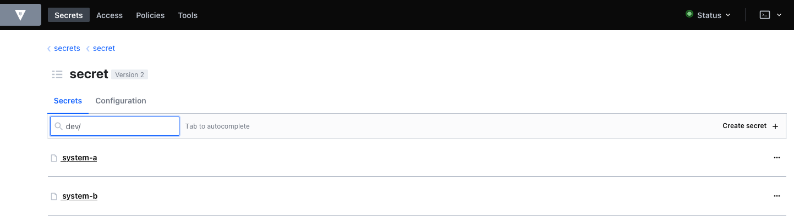
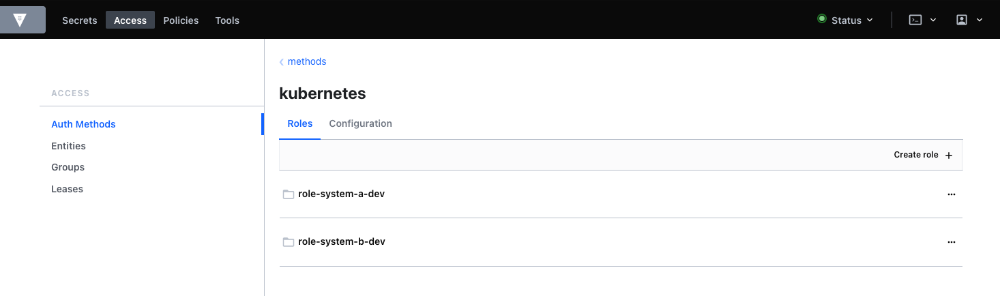
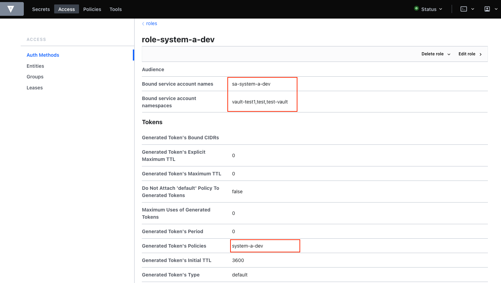

= Kubernetes Secrets 101
:author: Hafid Haddouti
:toc: macro
:toclevels: 4
:sectlinks:
:sectanchors:

toc::[]

== Overview

NOTE: In progress

Collection of guidance and solution how to handle secrets in a Kubernetes environment. From out-of-the-box solutions to additional extensions

* IBM Cloud Secrets Manager, based on HashiCorp Vault
* HashiCorp Vault self-managed

And additional plugins to retrieve and inject secrets into the Kubernetes resources.

link:https://kubernetes.io/docs/concepts/configuration/secret/[`Secret`] is an object in Kubernetes holding sensitive data. However this data is by default not encrypted and any user with right permissions (view `Secret`) can retrieve the details.
Depending how the `Secret` object is used is an update of the Secret data not visible to the deployment, this is the case for environment variables. If the `Secret` is mounted to the container is any change to the container visible.

TIP: Consider always to use a Kubernetes cluster with encrypted etcd and restrict the access to the cluster with RBAC!

== IBM Cloud Secrets Manager & kubernetes-external-secrets

link:https://cloud.ibm.com/docs/secrets-manager[IBM Cloud Secrets Manager] built on top of the open source HashiCorp Vault solution and provides a managed offering to maintain centralized secrets, secured and protected.

Due the fact, that internally HashiCorp Vault is integrated, most of the existing plugins/agents could use. The simplest way is to use the Vault cli to interact with IBM Cloud Secrets Manager. In this option however the existing https://github.com/external-secrets/kubernetes-external-secrets[kubernetes-external-secrets] plugin will be used to interact with the service.
With the CRD `ExternalSecret` a relation to a stored secret in IBM Cloud Secrets Manager instance is established. The result is a generated Kubernetes `Secret` with the sensitive data.
In addition `kubernetes-external-secrets` observe the registered secret and updates the `Secret` if any changes occur.

The scenario show cases the following

* create a secret in the Secrets Manager
* deploy `ExternalSecret` which retrieves the secret and 
* ...automatically creates a `Secret` object holding the secret (here: credentials / username and password)
* updating the secret in the Secrets Manager
* will trigger automatically an update of the `Secret` object

Beforehand a short summary how to install and configure `kubernetes-external-secrets` with IBM Cloud Secrets Manager. For details consult the link:https://cloud.ibm.com/docs/secrets-manager?topic=secrets-manager-tutorial-kubernetes-secrets[docu].

.Tasks to install and configure
* Create a service ID
* ...assign permmissions to the new service ID to interact with the Secrets Manager instance
* ...create an API Key for the service ID
* Prepare Kubernetes-External-Secrets installation
** get the user-specific Secrets Manager instance endpoint
** create a link:https://cloud.ibm.com/docs/secrets-manager?topic=secrets-manager-secret-groups[secret group] (here `sg-demo`) and probably also some secrets
** create Kubernetes `Secret` with the generated API Key
** Install Kubernetes-External-Secrets via Helm3 and setting correct parameters

Execute the script link:scripts/ibm-cloud-sm-setup.sh[] or check the following listing to prepare and setup `kubernetes-external-secrets`.

.Summary of the commands
[%collapsible]
====
----
# create Service ID and API Key
$ export SERVICE_ID=`ibmcloud iam service-id-create kubernetes-secrets-tutorial --description "A service ID for testing Secrets Manager and Kubernetes Service." --output json | jq -r ".id"`; echo $SERVICE_ID
$ ibmcloud iam service-policy-create $SERVICE_ID --roles "SecretsReader" --service-name secrets-manager
$ export IBM_CLOUD_API_KEY=`ibmcloud iam service-api-key-create kubernetes-secrets-tutorial $SERVICE_ID --description "An API key for testing Secrets Manager." --output json | jq -r ".apikey"`

# Prepare Secrets Manager with secret group and dummy secret
$ export SECRETS_MANAGER_URL=`ibmcloud resource service-instance my-secrets-manager --output json | jq -r '.[].dashboard_url | .[0:-3]'`; echo $SECRETS_MANAGER_URL

$ export SECRET_GROUP_ID=`ibmcloud secrets-manager secret-group-create --resources '[{"name":"sg-demo","description":"Demo App and Secrets."}]' --output json | jq -r ".resources[].id"`; echo $SECRET_GROUP_ID

$ export SECRET_ID=`ibmcloud secrets-manager secret-create --secret-type username_password  --resources '[{"name":"example_username_password","description":"Extended description for my secret.","secret_group_id":"'"$SECRET_GROUP_ID"'","username":"user123","password":"cloudy-rainy-coffee-book","labels":["env-demo","demo"]}]' --output json | jq -r ".resources[].id"`; echo $SECRET_ID

# Create Secret with API Key, URL and type
$ kubectl -n default create secret generic secret-api-key --from-literal=apikey=$IBM_CLOUD_API_KEY

$ kubectl -n default create secret generic ibmcloud-credentials --from-literal=apikey=$IBM_CLOUD_API_KEY \
--from-literal=endpoint=$SECRETS_MANAGER_URL \
--from-literal=authtype=iam

# Install Kubernetes-External-Secrets
$ helm3 repo add external-secrets https://external-secrets.github.io/kubernetes-external-secrets/
$ helm3 install kubernetes-external-secrets external-secrets/kubernetes-external-secrets -f kes-ibm-cloud-sm-values.yaml
----
====

After the installation of `kubernetes-external-secrets` are we ready to walk through the scenario.

The `ExternalSecret` establish a reference to a secret in the Secrets Manager (via the UUID). This results into a created `Secret` with the same name (here: `externalsecret-demo-creds-01`)

----
$ kubectl apply -f scripts/external-secret.yaml

$ kubectl get secret externalsecret-demo-creds-01 -o yaml | grep -A2 -e '^data'
data:
  password: bWVnYS1pbXBvcnRhbnQtMjAyMS0wOS0xOV8xNDo1MDo1MA==
  username: YVVzZXIwMw==
----

An update of the secret in the Secrets Manager triggers automatically an update of the ``Secret``s object. The existing `scripts/ibm-cloud-sm-update-secret.sh` supports the update and adds current timestamp to the password.

----
$ ./scripts/ibm-cloud-sm-update-secret.sh

$ kubectl get secret externalsecret-demo-creds-01 -o json | jq -r .data.password | base64 --decode
mega-important-2021-09-19_14:50:50
----

The link:examples/externalsecret-base.yaml[] resource file contains a deployment with some containers printing out frequently the values of the env and mounted variables. 

----
$ kubectl apply -f examples/externalsecret-base.yaml

$ kubectl logs -f -l app=showcase
...
021-09-19 15:30:16: [From Main container] ...waiting...
[Main container] ...waiting...
Mounted:
username=aUser03
password=mega-important-2021-09-19_15:27:41
Env:
SHOWCASE_PASSWORD=dummy-value
SHOWCASE_USERNAME=dummy
-------------------------------------------
----

As visible in the output, the values in the env variables are still the old one, while the values have changed. As it can be seen for the mounted variables.

=== Summary

With IBM Cloud Secrets Manager exists an offering base on HashiCorp Vault. The `kubernetes-external-secrets` extension allows a very simple integration in Kubernetes. Also updates will be automatically applied. The extensions supports various providers and configuration parameters.

The drawback - from the security perspective - are

* the secrets are in `Secret` object and could be retrieved if the user has enough permissions to view ``Secret``s in Kubernetes. This circumstance is not new and a strict RBAC should always be part of the solution.
* Changes in existing `Secret` object are not automatically visible to the container if bound as environment variable. A restart is needed.

=== References

* link:https://cloud.ibm.com/docs/secrets-manager?topic=secrets-manager-tutorial-kubernetes-secrets[IBM Cloud Secrets Manager - Kubernetes integration]
* link:https://learn.hashicorp.com/tutorials/vault/kubernetes-external-vault?in=vault/kubernetes[Vault install - external vault, agent in cluster]
* link:https://github.com/external-secrets/kubernetes-external-secrets[GitHub: kubernetes-external-secrets]

== HashiCorp Vault & Vault agent

In this section we will use the vault agent to inject secrets from a HashiCorp Vault instance.
In case you have to install a self-managed HashiCorp Vault instance consider the next sub chanter for a brief overview.
The subsequent chapter will handle the secrets injection mechanism.

=== HashiCorp Vault installation

HashiCorp Vault provides a link:https://www.vaultproject.io/docs/platform/k8s[Helm Chart] for the installation.

Briefly an overview of the main steps for the installation and configuration. All namespaces with the label `vaultinjection=enabled` will be observed from the Agent Injector.

----
$ git clone https://github.com/hashicorp/vault-helm -b v0.17.1 --single-branch

$ cd vault-helm

$ oc new-project vault-backend

$ helm3 upgrade --install hashicorp-vault . \
 --set "global.openshift=true" \
 --set "server.dev.enabled=true" \
 --set "server.logLevel=trace" \
 --set "injector.metrics.enabled=true" \
 --set "injector.namespaceSelector.matchLabels.vaultinjection=enabled" \
 --set "injector.logLevel=trace" \
 --namespace vault-backend

$ oc label namespace vault-backend vaultinjection=enabled
namespace/vault-backend labeled

$ oc label namespace vault-test1 vaultinjection=enabled
namespace/vault-test1 labeled

$ oc label namespace vault-test2 vaultinjection=enabled
namespace/vault-test2 labeled
----

or use the link:scripts/vault.values.openshift.yaml[]

----
$ helm3 upgrade --install hashicorp-vault . -f ../../scripts/vault.values.openshift.yaml
----

NOTE: *Attention* `server.dev.enabled=true` installs Vault in dev mode, with memory storage - never use this for production. Use Raft or Consul!

Wait for the completion of the deployment and afterwards initialize and unseal Vault (not necessary for dev mode)

----
$ oc exec -ti hashicorp-vault-0 -- vault operator init

$ oc exec -ti hashicorp-vault-0 -- vault operator unseal
----

To access the Vault UI expose the UI

----
$ oc expose svc hashicorp-vault
route.route.openshift.io/hashicorp-vault exposed

$ oc get routes
NAME              HOST/PORT                                    PATH     SERVICES          PORT   TERMINATION   WILDCARD
hashicorp-vault   hashicorp-vault-test......appdomain.cloud             hashicorp-vault   http                 None
----

After calling the route and use e.g. the root token to access the UI one have the possibility to set secrets.

NOTE: The root token in Vault dev mode is printed out in the `hashicorp-vault-0` pod.

=== HashiCorp Vault Agent Sidecar

By default the link:https://www.vaultproject.io/docs/platform/k8s/injector[Vault Agent injector] will be also installed, otherwise use the link:https://www.vaultproject.io/docs/platform/k8s/injector/installation[docu]. Vault Agent injector retrieves secrets from Vault and stores them on a shared volume as file using a custom or default template.

To enable the communication between the agent and Vault instance is it necessary to configure the auth method, like https://www.vaultproject.io/docs/auth/kubernetes#configuration[Kubernetes Auth method]

.Enable and configure Kubernetes Auth method and first roles
----
$ oc exec -ti hashicorp-vault-0 -- /bin/sh

$ vault auth enable kubernetes
Success! Enabled kubernetes auth method at: kubernetes/

$ vault write auth/kubernetes/config \
  token_reviewer_jwt="$(cat /var/run/secrets/kubernetes.io/serviceaccount/token)" \
  kubernetes_host="https://$KUBERNETES_PORT_443_TCP_ADDR:443" \
  kubernetes_ca_cert=@/var/run/secrets/kubernetes.io/serviceaccount/ca.crt
Success! Data written to: auth/kubernetes/config

$ vault write auth/kubernetes/role/role-system-a-dev \
    bound_service_account_names=sa-system-a-dev \
    bound_service_account_namespaces=vault-test1,test,vault-test3 \
    policies=system-a-dev \
    ttl=1h
Success! Data written to: auth/kubernetes/role/role-system-a-dev

$ vault write auth/kubernetes/role/role-system-b-dev \
    bound_service_account_names=sa-system-b-dev \
    bound_service_account_namespaces=vault-test2,test \
    policies=system-b-dev \
    ttl=1h
Success! Data written to: auth/kubernetes/role/role-system-b-dev
----

Now k8s auth method is enabled and the first roles with the following configuration 

|===
| Role | Namespace | Service Account
| `role-system-a-dev` | `vault-test1`, `vault-test3`, `test` | `sa-system-a-dev`
| `role-system-b-dev` | `vault-test2`, `test` | `sa-system-b-dev`
|===

Create the policy via the UI (Policies > Create ACL policies)

.`system-a-dev` policy
----
path "secret/data/dev/system-a" {  
  capabilities = ["list", "read"]
}
----

.`system-b-dev` policy
----
path "secret/data/dev/system-b" {  
  capabilities = ["list", "read"]
}
----

The following diagrams visualize the made configuration in the Vault UI

.Vault Access: Kubernetes auth method and available roles

.Vault Access: Kubernetes auth method and one role details

=== Action

After the previous installation and configuration of the agent injector, let's see this in action.

The link:examples/vault-agent-base.yaml[] contains some resources for the example.

* Deployment with annotation to retrieve secrets from Vault
* Vault Agent injector use this meta information to interact with Vault
* retrieves the secrets and stores them on a shared volume, mounted into the container/POD
* the application uses the file with the secret on the shared volume to set env variables (via `source`) and prints them out in a loop

Beforehand some secrets are needed. To match the Vault policies e.g. the following secrets are created in `secret/dev/system-a` (respective `secret/dev/system-b`)

[source,json]
----
{
  "db_password": "SystemA.DB-Password.Dev",
  "db_userid": "SystemA.DB-User.Dev"
}
----

.Deploy app and all relevant resources
----
$ oc project vault-test1

$ oc apply -f examples/vault-agent-init.yaml
serviceaccount/sa-system-a-dev created
serviceaccount/sa-system-b-dev created

$ oc apply -f examples/vault-agent-base.yaml

secret/vault-demo-creds-01 created
configmap/showcase-scripts created
deployment.apps/showcase-vault-deployment created
----

.Verify the logs and created files with secrets from Vault
----
$ oc logs -f -l app=showcase-vault --all-containers

[Main container] ...waiting...
Env:
...sourcing env-file with content from Vault...
db_password=SystemA.DB-Password.Dev
db_userid=SystemA.DB-User.Dev

$ oc exec -ti showcase-vault-deployment-6f4bccd8dd-z9phr -- /bin/sh
ls -l /vault/secrets/
total 8
-rw-r--r--    1 10008800 10008800        92 Oct 11 09:30 db-env
-rw-r--r--    1 10008800 10008800        24 Oct 11 09:30 db.cfg

cat /vault/secrets/db.cfg
SystemA.DB-User.Dev
----

Vault Agent link:https://www.vaultproject.io/docs/agent/template#renewals-and-updating-secrets[renews] the secrets regularly (by default all 5mins). This means, changes of a secret in Vault will be visible in the container - correctly in the file on the shared volume - after a short period, without the need to restart the container.

The role in the annotation `vault.hashicorp.com/role` has to match the correct role which is linked to the policy which allows the access of the desired secrets. E.g. if the secrets `dev/system-b` are not under the policy and corresponding role, any access will not be successful and a deployment will fail. Use for this example the configuration in link:examples/vault-agent-fail.yaml[]

Another example link:examples/vault-agent-systemb.yaml[] contains the deployment and configuration to access the `dev/system-b` secrets, but needs to be deployed in the namespace `vault-test2`.

=== Summary

This chapters covered the direct secret injection with the HashiCorp Vault Agent injector. This is, after the mandatory configuration very straight forward in the usage, with the Kubernetes annotations to define and configure which secrets are wanted.
One of the main draw-back is that the secrets are stored as file on a shared volume. A direct provisioning as environment variable is not possible. Also the creation of Kubernetes `Secret` is not possible.

With this is the HashiCorp Vault Agent injector a good, but lightweight solution to inject secrets. Other injection solutions provides more advanced features.

=== References

* link:https://www.vaultproject.io/docs/platform/k8s/helm/openshift[HashiCorp Vault: OpenShift Installation]
* link:https://www.vaultproject.io/docs/agent/template#renewals-and-updating-secrets[Vault Agent Secret Renewal]

== HashiCorp Vault & Banzai Cloud bank-vault Mutating Webhook

This scenario use the link:https://banzaicloud.com/docs/bank-vaults/mutating-webhook/[Mutating Webhook] from the vault tool suite link:https://banzaicloud.com/docs/bank-vaults/overview/[bank-vault] from Banzai Cloud.
The difference of this solution is that it never stores the sensitive data and keeps everything in memory. Additionally it supports the injection of secrets into `ConfigMap` and `Secret` resources.

=== HashiCorp Vault installation

see the previous section how to install HashiCorp Vault.

=== Mutating Webhook installation

The installation use a link:https://github.com/banzaicloud/bank-vaults/tree/master/charts/vault-secrets-webhook[Helm Chart] and explained in the link:https://banzaicloud.com/docs/bank-vaults/mutating-webhook/deploy/[deployment page]. The main steps are summarized here

.Commands to install the webhook
----
$ oc new-project vault-webhook

$ git clone https://github.com/banzaicloud/bank-vaults.git -b v1.14.2 --single-branch

$ cd bank-vaults/charts/vault-secrets-webhook

$ helm3 upgrade --install banzai-vault-webhook . \
 -f scripts/webhook.values.openshift.yaml

----

.Commands to prepare the test namespace
----
$ oc new-project vault-test3
$ oc label namespace vault-test3 webhookinjection=enabled
namespace/vault-test3 labeled
----

In case the runtime is OpenShift consider the following security adjustments for the service account `banzai-vault-webhook-vault-secrets-webhook`:

----
$ oc adm policy add-scc-to-user anyuid -z banzai-vault-webhook-vault-secrets-webhook
$ oc adm policy add-scc-to-user privileged -z banzai-vault-webhook-vault-secrets-webhook
----

Check if the 2 pods are up and running

----
$ oc get pods -n vault-webhook
NAME                                                          READY   STATUS    RESTARTS   AGE
banzai-vault-webhook-vault-secrets-webhook-7d4d7bbdc5-jh5qz   1/1     Running   0          26s
banzai-vault-webhook-vault-secrets-webhook-7d4d7bbdc5-w74rk   1/1     Running   0          26s
----

Now you have the webhook installed.

=== Action

Let's see the secret mutating webhook in action.

Apply the link:examples/vault-webhook-base.yaml[] which deploys the same base application with the relevant annotations in the namespace `vault-test3`.

[source,yaml]
----
    annotations:        
        # the address of the Vault service, default values is https://vault:8200
        vault.security.banzaicloud.io/vault-addr: "http://hashicorp-vault.test:8200"
        # the default value is the name of the ServiceAccount the Pod runs in, in case of Secrets and ConfigMaps it is "default"
        vault.security.banzaicloud.io/vault-role: "role-system-a-dev"
        vault.security.banzaicloud.io/vault-skip-verify: "true" 
    spec:
      # Specific sa, relevant for Vault interaction
      serviceAccountName: sa-system-a-dev
      containers:
      - name: showcase-vault
        image: busybox:1.28
        command: ['sh', '-c', '/scripts/secrets-output.sh']
        env:
        - name: DB_USERID
          value: vault:secret/data/dev/system-a#db_userid
        - name: DB_PASSWORD
          value: vault:secret/data/dev/system-a#db_password
----

The reference of a secret path is defined as follows `vault:secret/data/dev/system-a#db_userid`.
The mutating webhook will handle this annotation, determine the secrets and holds them in the memory. Only the original process has the possibility to see the values.
Due the fact, that the base applications prints out the env variables on STDOUT is the value visible

----
$ oc apply -f examples/vault-webhook-base.yaml -n vault-test3
serviceaccount/sa-system-a-dev created
serviceaccount/sa-system-b-dev created
clusterrolebinding.rbac.authorization.k8s.io/sa-system-a-dev-test-vault-role-tokenreview-binding created
secret/vault-demo-creds-01 created
configmap/showcase-vault-scripts created
deployment.apps/showcase-vault-deployment created

$ oc logs -f -l app=showcase-vault --all-containers -n vault-test3
time="2021-10-12T19:01:04Z" level=info msg="received new Vault token" addr= app=vault-env path=kubernetes role=role-system-a-dev
time="2021-10-12T19:01:04Z" level=info msg="initial Vault token arrived" app=vault-env
time="2021-10-12T19:01:04Z" level=info msg="spawning process: [sh -c /scripts/secrets-output.sh]" app=vault-env
add.sh script
[Main container] ...waiting...
Env:
DB_USERID=SystemA.DB-User.Dev
DB_PASSWORD=SystemA.DB-Password.Dev2
-------------------------------------------
[Main container] ...waiting...
Env:
DB_USERID=SystemA.DB-User.Dev
DB_PASSWORD=SystemA.DB-Password.Dev2
----

But entering the container and trying to print out the env variables results only the in the meta information

----
oc exec -ti showcase-vault-deployment-854d8c6d48-8wq7h -- env | grep -i db
DB_USERID=vault:secret/data/dev/system-a#db_userid
DB_PASSWORD=vault:secret/data/dev/system-a#db_password
----

=== Summary

The Banzai secret webhook based on mutating webhooks provides here a more secured solution to retrieve and inject secrets. Due the fact, that the secrets kept in memory and only the new spawned process has the possibility to retrieve the secrets is an additional security barrier.
Also the capabilities to inject secrets into `ConfigMap` and `Secret` are advantages for this solution.

=== References

* link:https://banzaicloud.com/docs/bank-vaults/mutating-webhook/[Banzai Cloud: Mutating Webhook]
* link:https://github.com/banzaicloud/bank-vaults/tree/master/charts/vault-secrets-webhook[Helm Chart of webhook]

== Summmary

Secrets and their handling is a serious topics in any cloud environment. Luckily various solutions options exists to integrate managed secrets into applications running in a Kubernetes environment. Not all here shown options fulfill all requirements and use cases. Thereby the appropriate option must be used for the own context and solution. Below is a comparison of the most important features.

|===
| Requirement | Vault Agent Injector | Banzai Webhook

| Supports k8s auth method | Yes | Yes
| Supports Vault role | Yes | Yes
| Supports Vault AppRole | link:https://www.vaultproject.io/docs/platform/k8s/injector/examples#approle-authentication[Yes] | Unclear
| Supports injection in k8s `ConfigMap` | No | Yes
| Supports injection in k8s `Secret` | No | Yes
| Supports exposing environment variable | Not directly, only via template & `source` | Yes
| Secrets visibility limited | No, any process and user can see content | Yes, only visible to spawned process
| Secrets accessibility limited by k8s service account | Yes | Yes
| Secrets accessibility limited by k8s namespace | Yes | Yes
| Supports recognition of secret changes | Yes | No

|===

== References

n/a - see above in the separate sections.

== License

This article and project are licensed under the Apache License, Version 2.
Separate third-party code objects invoked within this code pattern are licensed by their respective providers pursuant
to their own separate licenses. Contributions are subject to the
link:https://developercertificate.org/[Developer Certificate of Origin, Version 1.1] and the
link:https://www.apache.org/licenses/LICENSE-2.0.txt[Apache License, Version 2].

See also link:https://www.apache.org/foundation/license-faq.html#WhatDoesItMEAN[Apache License FAQ]
.